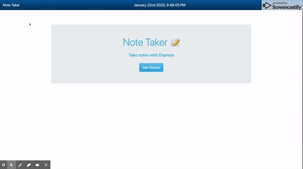

# Notes Taker App with Node.js, Express.js and Heroku
​
## Description
​
Express application that can be used to write, save, and delete notes. This application use an express backend and save and retrieve note data from a JSON file.
​
* The application frontend is created using HTML, CSS, Bootstrap, Javascript, jQuery and backend work is done using Node.js & Express.js.
​
* The following HTML routes have been created:
​
  * GET `/notes` - return the `notes.html` file.
​
  * GET `*` - return the `index.html` file
​
* The application have a `db.json` file on the backend that is used to store and retrieve notes using the `fs` module.
​
* The following API routes are created:
​
  * GET `/api/notes` - read the `db.json` file and return all saved notes as JSON.
​
  * POST `/api/notes` - recieve a new note to save on the request body, add it to the `db.json` file, and then return the new note to the client.
​
  * DELETE `/api/notes/:id` - recieve a query paramter containing the id of a note to delete.
​
## Folder Structure

```
db/             // contains json file that stores notes
public/         // front end
  assets/       //Folder contains css and client-side JavaScript
    css/
    js/
  index.html
  notes.html
routes/         // API and HTML routes
  apiRoutes.js  
  htmlRoutes.js
server.js       // Runs the application
```

```

## Running the Application

These instructions will get you a copy of the project up and running on your local machine for development and testing purposes. See deployment for notes on how to deploy the project on a live system.


```sh
npm install
node server.js
```

## Application Demo


## User Story
​
AS A user, I want to be able to write and save notes
​
I WANT to be able to delete notes I've written before
​
SO THAT I can organize my thoughts and keep track of tasks I need to complete
​
## Business Context
​
For users that need to keep track of a lot of information, it's easy to forget or be unable to recall something important. Being able to take persistent notes allows users to have written information available when needed.
​
## Application Functionality
​
Application allow users to create and save notes.
​
Application allow users to view previously saved notes.
​
Application allow users to delete previously saved notes.
​
# Technologies Used
  * Node.js
  * Express.js
  * Javascript
  * jQuery
  * Bootstrap
  * HTML 
  * CSS 
  * FS
  * Path